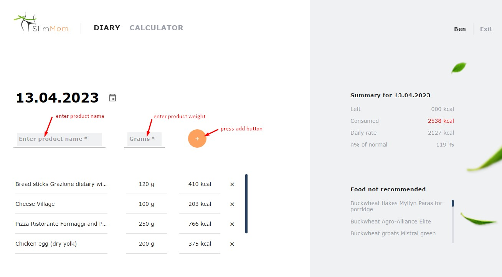

# Slim-mom-frontend

The application helps to keep track of the calories of the food eaten. Based on
the entered data about the user, you can calculate the daily caloric intake and
get a list of products not recommended for consumption. Responsive layout
website. Team project. Role: Team Lead/Developer. My task is to set up the
project structure, routing, Redux logic, backend development.

## Usage

- follow the [link](https://andrii-posternak.github.io/slim-mom-frontend/) to
  get started
- fill out the form and click "Start losing weight"  
   
- added a new product and its weight  
  

## Created with

:white_check_mark: React  
:white_check_mark: Redux Toolkit  
:white_check_mark: HTML  
:white_check_mark: SASS  
:white_check_mark: Webpack  
:white_check_mark: Material UI  
:white_check_mark: REST API
